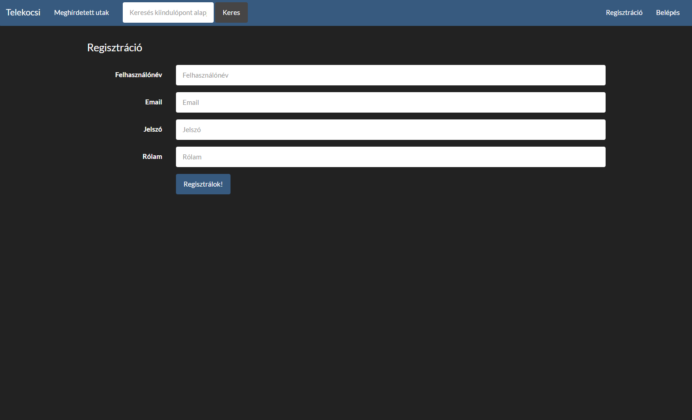

# Dokumentáció
## Telekocsi
Készítette: Erdei Márk

###	Követelményanalízis
#####	Célkitűzés, projektindító dokumentum
A program legfőbb célja jól átláthatóan és érthetően megjeleníteni a meghirdetett utazásokat klt véros között egyoldali alkalmazás felhasználásával. Az adatok védelme érdekében legyen lehetőség regisztrációra, majd bejelentkezésre. Bejelentkezett felhasználó a hirdetések listáját megtekintheti, bővítheti, saját hírdetéseit törölheti, valamit szerkesztheti. 

######Funkcionális követelmények:
* Regisztráció
* Bejelentkezés
* Csak bejelentkezett felhasználók által elérhető funkciók:
  - új utazás feladása
  - a meglévő utazás szerkesztése
  - a meglévő utazás törlésére

######Nem funkcionális követelmények:
*	**Könnyű áttekinthetőség:** Egy utazáshoz tartozó adatok keretbe foglalása
*	**Használhatóság:** Könnyű áttekinthetőség, ésszerű elrendezés, könnyen kezelhetőség
*	**Megbízhatóság:** Jelszóval védett funkciók, hibásan bevitt adatok esetén a program jól láthatóan jelezzen a felhasználónak
*	**Karbantarthatóság:** Könnyen lehessen bővíteni az alkalmazást, a különböző funkcionalitással rendelkező fájlok külön csoportosítása, ésszerű felépítés

#####	Használatieset-modell, funkcionális követelmények

**Vendég**:

*	Főoldal
*	Bejelentkezés
*	Regisztráció
* Utazások közötti böngészés

**Bejelentkezett felhasználó**:

*	Új utazás feladása
*	Saját utazás szerkesztése
*	Meglévő utazás törlése

###Tervezés

#####	Architektúra terv

###### Oldaltérkép:

**Publikus:**
* Főoldal
* Meghírdetett utak
* Keresés
* Bejelentkezés
* Regisztráció

**Bejelentkezett:**
* Főoldal
* Új utazás hírdetése
* Saját utazások:
  * Törlése 
  * Szerkesztése
* Saját profil megtekintése
  * Jelszó változtatása

###### Végpontok

* GET/: legfrisebb utazások oldala(főoldal)
* GET/login: bejelentkező oldal
* POST/login: bejelentkező adatok felküldése
* GET/register: regisztrációs oldal
* POST/register: regisztrációs adatok felküldése
* GET/logout: kijelentkező oldal
* GET/profile/=id: profil megtekintése
* GET/profile/=id/editprofile: jelszóváltoztatás
* POST/profile/=id/editprofile: jelszóváltoztatás, adatok felküldése

* GET/create: új utazás
* POST/create: új utazás, adatok felküldése
* GET/search: utazás keresése
* GET/browse: hirdetések böngészése
* GET/browse: mylist/=poster: saját hirdetések megtekintése

* GET/telekocsi/=id: utazás megtekintése
* GET/telekocsi/=id/edit: utazás szerkesztése
* POST/telekocsi/=id/edit: utazás szerkesztése, adatok felküldése
* GET/telekocsi/=id/delete: utazás törlése

###### Adatbázis

######Nem funkcionális követelmények:

*	**Telekocsis:** 
	* _id_
	* _category_id_
	* _fromm_
	* _to_
	* _when_
	* _seats_
	* _price_
	* _contact_
	* _poster_

*	**Users:** 
	* _id_
	* _username_
	* _email_
	* _password_
	* _aboutme_

*	**Categories:** 
	* _id_
	* _name_

###	Implementáció
###### A feladat megvalósításához az AdonisJS keretrendszert használtam.
###### Főbb fejlesztői fájlok MVC struktúrában

  * **controllers**
    * _TelekocsiController.js_
    * _UserController.js_
  * **models**
    * _Category.js_
    * _Telekocsi.js_
    * _Token.js_
    * _User.js_
  * **views**:
      * _login.njk_
      * _register.njk_
      * _browse.njk_
      * _create.njk_
      * _edit.njk_
      * _main.njk_
      * _mylist.njk_
      * _search.njk_
      * _show.njk_
      * _profile.njk_
      * _editprofile.njk_
    * _parent.njk_

#####Felhasználói-felület modell

###### Designtervek:

**Főoldal**

**Meghírdetett utak**

**Keresés**

**Regisztráció**

**Belépés**

**Profilom**

**Utazásaim**

**Új utazás**

**Utazás megtekintése/törlése**

**Utazás szerkesztése**

###	Felhasználói dokumentáció

**Futtatáshoz szükséges operációs rendszer:** Tetszőleges

**A futtatáshoz szükséges hardver:** Operációs rendszerek szerint megadva

**Egyéb követelmények:** Böngésző, JavaScript

**Program használata:**

1. Böngészőben nyissuk meg az oldalt.
2. Jobb felső sarokban Belépés/Regisztráció gombra kattintva a mezők kitöltése után főoldalra jutunk.
3. Felül az Új utazás hírdetése gombra kattintva tudunk új hirdetést felvenni a listába.
4. Feladás gombra kattintva mentsük el az adatokat. Hibás adatok kitöltése esetén az űrlap jelezni fogja a hibát.
5. A hirdetés címére kattintva kijön annak teljes oldala, ahol a törölhetjük vagy szerkeszthetjük saját hírdetéseinket.